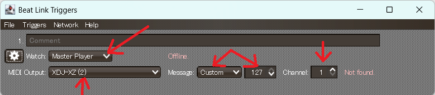
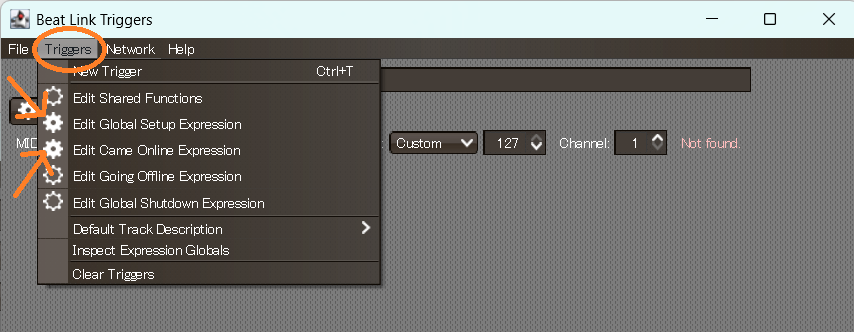
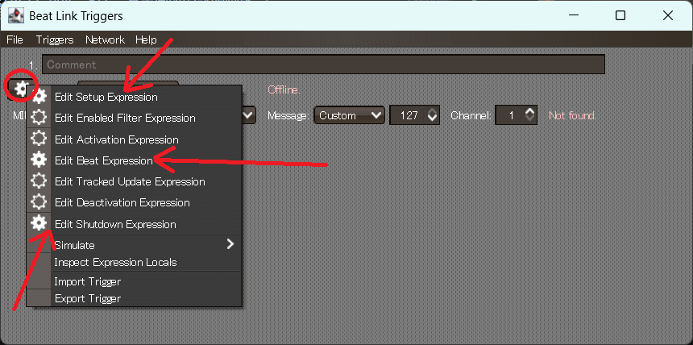
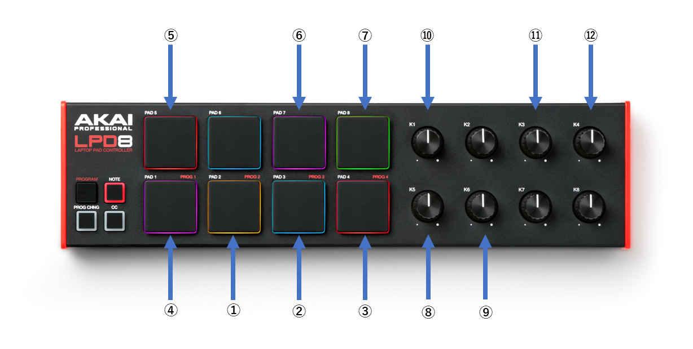

# LEDテープ制御用プログラムの使い方

- 前提としてBluetoothとUSB接続が必要になりますので、BluetoothとUSBポートのあるPCが必要です。
- またPCDJ時はBeatlinkTriggerが動作しないため、BPM自動取得機能が使えなくなります。
- 分からない事があったら気軽に聞いてください。  
   (分かるとは言ってない)

## 環境構築

### 1. pythonのインストール

Pythonをインストールしてください。
推奨バージョンは Python 3.13.3 です。

(他のバージョンでも多分動くと思います。知らんけど)

[Pythonのダウンロードリンク](https://www.python.org/downloads/)

> [!NOTE]
>windows以外の場合自動でpipが入らいないことがあります。
>
>その場合は個別で導入してください

### 2. BeatlinkTriggerのインストール

XDJからBPM情報を取得するのに使用するBeatlinkTriggerをインストールしてください。

推奨バージョンはv7.4.1です。
(他のバージョンでも多分動くと思います。知らんけど)

[BeatklinkTriggerのダウンロードリンク](https://github.com/Deep-Symmetry/beat-link-trigger/release)

### 3. gitのインストール

無くてもいいですが導入推奨です。

[gitのダウンロードリンク](https://git-scm.com/downloads)  

## 導入及び起動準備

### 1. 接続

XDJとPCをUSBケーブルもしくはLANケーブルで接続してください。  
(LANケーブルを使う場合はXDJのExtension端子にさしてください。)

同様にLPD8 Mk2(LED制御用midiコントローラー)もUSBケーブルでPCに接続してください。

### 2. BeatlinkTriggerの設定(初回のみ)

BeatlinkTriggerを起動し下記の設定を記述通りに変更してください。  
(なんでこの設定で動くのか私もよくわかってないので😇、Clojureとか分かる人いたら教えてください。)

| 変更箇所 (下記図1参照) | 設定 |
| :--- | ---: |
| wWatch | Master Player |
| Midi Output | XDJ-XZ |
| Message | Custom / 127 |
| Channel | 1 |

    
    
図1 変更箇所の説明

 

- Triggers / Edit Global Setup Expression（下記図2参照）
~~~Clojure
(set-overlay-background-color (Color. 0 0 0 0))
(swap! globals assoc :player-status-always-on-top true)
(swap! globals assoc :player-status-columns 2)
(when (.isRunning (VirtualCdj/getInstance))
  (beat-link-trigger.triggers/show-player-status))
~~~

- Triggers / Edit Came Online Expression（下記図2参照）
~~~Clojure
(triggers/show-player-status)
(overlay/run-server)
(beat-link-trigger.carabiner/show-window nil)  
(beat-link-trigger.carabiner/connect)  
(beat-link-trigger.carabiner/sync-mode :passive)  
(beat-link-trigger.carabiner/sync-link true)  
(beat-link-trigger.carabiner/align-bars true)
~~~

    
    
図2 変更箇所の説明

 

- XDJ-XZ / Edit Setup Expression (下記図3参照)
~~~Clojure
(swap! locals assoc :myVJapp (osc/osc-client "localhost" 7000))
~~~

- XDJ-XZ / Edit Beat Expression (下記図3参照)
~~~Clojure
(when trigger-active?
  (osc/osc-send (:myVJapp @locals) "/master/bpm" effective-tempo))
~~~

-　XDJ-XZ / Edit Shutdown Expression (下記図3参照)
~~~Clojure
(osc/osc-close (:myVJapp @locals))
~~~

    
    
図3 変更箇所の説明

 

### 3. 制御用プログラムのCloneと必要なパッケージのインストール(初回のみ)

>[!warning]
>git導入前提で話を進めていきます。

制御用プログラムを置きたいディレクトリに移動して下記コマンドを実行しCloneしてください。

~~~bash
git clone https://github.com/kawaguchililili/DMC_LED
~~~

基本的にはmainブランチを利用しますが、必要であればブランチを変更してください。  
(他のブランチに行けば開発中の機能があるかも？)
 
 

下記コマンドを実行して必要なパッケージをインストールしてください。

~~~bash
cd DMC_LED
pip install -r requirements.txt
~~~

## 3.起動

下記コマンドを実行して起動してください。

~~~bash
cd DMC_LED
python main.py
~~~

以下のURLにブラウザからアクセスしてください。  
→ http://127.0.0.1:5000/

表示がおかしい場合は適当に拡大率を変更してください。多分治ります。

## 4. 使い方

各チャンネルにプリセットを読み込むか、手動で各cカラーブロックに色を設定してください。既存のプリセットはpresetフォルダの中にあります。

- 各カラーブロックはBPMの半拍(八分音符)に該当します。  
- 黒色(RGB値:[0, 0, 0])を選ぶとそのカラーブロックでは暗転します。 
- 白色(RGB値:[255, 255, 255])を選ぶとそのカラーブロックは前のカラーブロックを発色します。

Play/Pauseボタンを押すかMidiコントローラーの該当Chのボタンを押すとLEDが指定した色の順で光ります。

>[!warning]
>プリセットを読み込むor色を設定する以外のことをブラウザからやるとたまにバグるので、プリセットを読み込むor色を設定する以外のことはコントローラーから行うことを推奨します。

Brightnessスライダーで明るさ、BPM欄でBPMが変更できます。  
(Select color mode機能は未実装です。)

>[!NOTE]
>各チャンネルのBrightnessとBPMは強制的にSyncされています。

### コントローラの割り当て

番号は下記図4を参照

1. ch1のPlay/Pause

2. ch2のPlay/Pause

3. ch3のPlay/Pause

4. ch4のPlay/Pause

5. 白・暗転を繰り返す独立chのPlay/Pause

6. カラーフェードモードのPlay/Pause

7. カラーブリンクモードのPlay/Pause

8. ch1~4のBPM変更用ノブ  
   変更可能値はXDJが出力するMasterBpmの1/4, 1/2, 1, 2, 4倍

9.  明るさ(Brightness値)変更用ノブ

10. 白・暗転を繰り返す独立chのBPM変更用ノブ
    変更可能値は0(白色点灯)及びXDJが出力するMasterBpmの1, 2, 4倍

11. カラーフェードモードのスピード変更用ノブ

12. カラーブリンクモードのスピード変更用ノブ

    
    
図4 コントローラの割り当て

 

## その他

基本の使い方は以上です。

多分定期的にバグって動作がおかしくなると思うんでその時はプログラム本体をCtrl + Cで強制終了して再起動してください。

Bluetoothの接続がバグった時は一回PC側のBluetoohをオフ→オンにして、プログラムを再起動したら大体治ります。